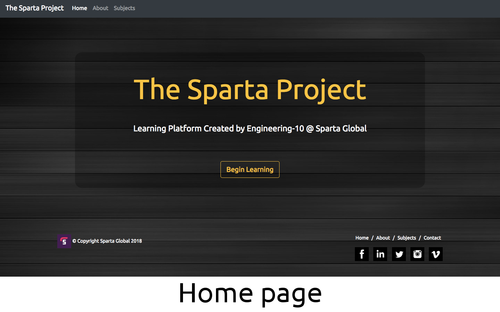
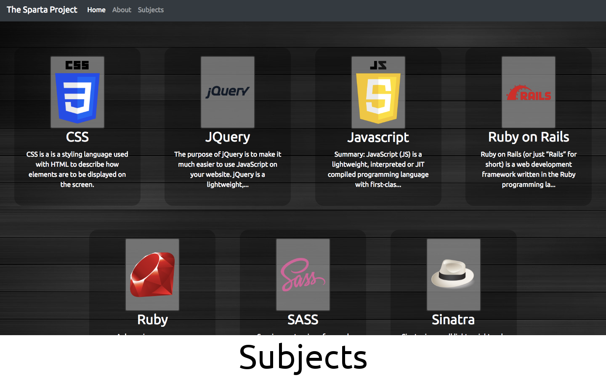
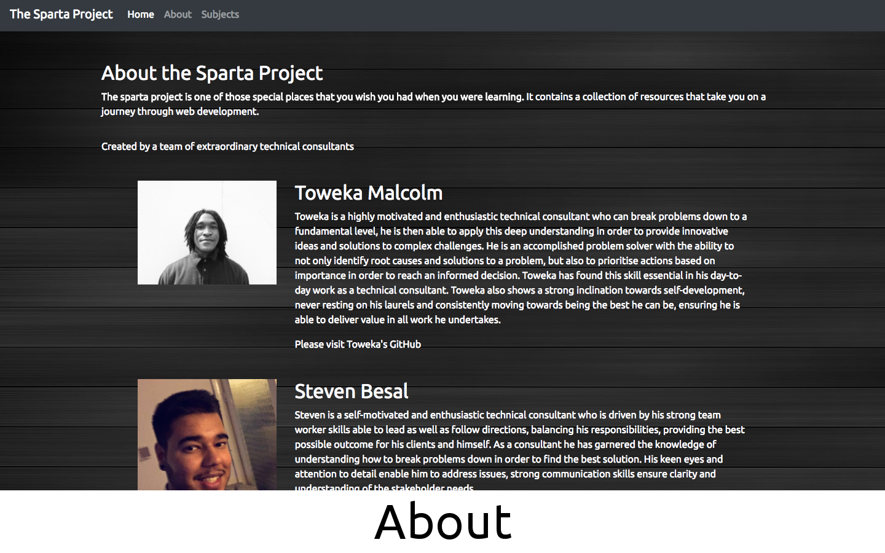
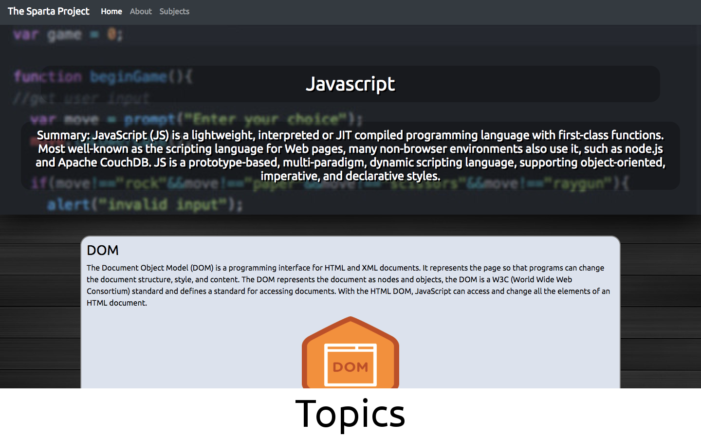

# Learning platform
### Developers:
Ali Karami,
Anne Cooke,
Joseph Cheung,
Pawan Kumar,
Sebastian Lewis,
Shaun Scott,
Steven Besal,
and Toweka Malcolm

### The Sparta Project
This site consists of a list of technologies we have learnt during training at Sparta Global

We were given 24 hours to complete this website, we did this in sprints with Ali coordinating everything and defining the stucture of the day in out basic scrum meeting.

### How to open the site
Requirements: Postgresql, rails
Clone or download the files navigate to the folder, then in terminal:
1. bundle
2. rails db:create
3. rails db:migrate
4. rails s
5. open your desired browser and visit localhost:3000

### The Site:

 

 

 

